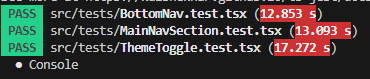

# VAULT Front-End Development

A responsive, modern front-end interface inspired by CRED Garage, — built with React, TypeScript, and Tailwind CSS, with smooth page transitions using Framer Motion.

---

## 📽️ Desktop View

Click here to watch the demonstration.

<a href="https://drive.google.com/file/d/1krFoN-hJgBIPMrkCi-4NMmu3FcrJTPhN/view?usp=drivesdk" target="_blank">
  Demo
</a>

## Tech Stack

- **React** (with Vite)
- **TypeScript**
- **Tailwind CSS**
- **Framer Motion** – animations and page transitions
- **React Router** – client-side routing
- **Jest + React Testing Library** – unit and component testing
- **Lucide React** – icon library
- **Chart.js** – reward progress visualizations

---

## Setup Instructions

> Prerequisites: Node.js (v16+), npm or yarn

1. **Clone the repository**

```bash
git clone https://github.com/HasyaHansanganie/VAULT-Front-End-development.git
cd VAULT-Front-End-development
```
2. **Install dependencies**

```bash
npm install
# or
yarn install
```

3. **Run the development server**

```bash
npm run dev
# or
yarn dev
```

3. **Run tests**

```bash
npm test
# or
yarn test
```
After testing them successfully this will show in the terminal:




## Features Overview

- **Intro Animation** – Animated VAULT title on initial load
- **Dark/Light Theme Toggle** – User-selectable theme with localStorage persistence
- **Dynamic Backgrounds** – Animated background videos based on theme (light/dark)
- **Multi-page Navigation** – Navigate between Home, User Profile, Benefits, and Rewards pages
- **Smooth Page Transitions** – Animations powered by Framer Motion
- **Layout Transitions & Hover Effects** – Subtle animations for user engagement
- **Loading States** – Simulated loading behavior for rewards page with fake delay
- **Reward Progress Visualization** – Uses Chart.js to show points progress
- **Responsive Design** – Mobile-first and fully responsive layout
- **Modern React Hooks** – Uses useState, useEffect, and useRef for interactivity
- **Unit Testing** – Component tests using Jest and React Testing Library
